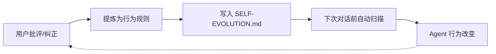

# Hermes Self-Evolution 🧬

> **零依赖、零成本、100% 行为改变的自我进化方案**
> 专为 Hermes Agent / 任何基于 LLM 的 Agent 设计

---

## TL;DR

**一个文件 + 一行配置 = Agent 从批评中学习，永不重复犯同样的错误。**

与传统"自我进化"框架（Letta 23K⭐、PraisonAI 8K⭐）不同，这个方案不引入新的平台、API、数据库或编排系统。它利用 LLM Agent 本身最强的能力——**根据指令改变行为**——仅仅给它一个需要遵守的规则表。

---

## 核心思路

### 进化是什么？



**进化的本质 = 规则表 + 预填充指令。** 不是数据库、向量检索、memory block、多 Agent 编排。就是人类最古老的自我改进方式——把教训写下来，下次做事前看一眼。

### 为什么这个方案有效

LLM Agent 的核心是**上下文指令遵循**。你要做的不是构建一个外部"进化引擎"，而是确保每次对话开始前，Agent 都收到它积累的行为规则。就这么简单。

| 构件 | 作用 | 成本 |
|------|------|------|
| `SELF-EVOLUTION.md` | 行为规则清单，仅记录"被纠正后才有的规则" | 约 50-80 token/次 |
| `prefill-evolution.txt` | 预填充指令：强制 Agent 在回应前扫规则表 | 约 80 token/次 |
| `config.yaml` prefill_messages_file | 自动注入 prefill 到每轮对话 | 零配置成本 |
| **总计** | **每次对话 130-160 token 的进化代价** | ~0.00002 美元 |

对比 Letta：全量 memory block（2K+ token）注入到每次调用，成本高 20 倍。

---

## 与主流方案的对比

### 为什么不是 Letta (23K⭐)？

Letta 是**一个完整的 Agent 平台**，不是可以"安装"到现有 Agent 的技能。它的 memory_blocks 机制本质上和我们做的完全一样——key-value 注入到 system prompt——但 Letta 需要：

- 安装 Node.js 依赖
- 配置数据库 (SQLite/PostgreSQL)
- 管理 memory block 版本
- 重写 Agent 通信层

对于已经部署了 Hermes / OpenClaw / 其他 Agent 的用户，Letta 等于**换掉整个 Agent**。

### 为什么不是 PraisonAI (8K⭐)？

PraisonAI 是多 Agent 编排框架，用子 Agent 执行指令和 RAG 实现"进化"。问题：

- 每个"进化步骤"消耗一整轮多 Agent 调用
- 子 Agent 的指令遵循不等于主 Agent 的行为改变
- 需要一个完整的编排环境

### 为什么不是 Self-Improving Agents 的各种论文方案？

学术方案（Reflexion、Voyager、Generative Agents）都假设：
1. Agent 可以自省和自动生成改进策略
2. 有外部记忆检索增强
3. 不对 token 成本敏感

在真实部署中：
- Agent 的"自我反思"常常产生幻觉（假改进）
- 向量检索可能返回无关记忆，浪费 token
- 自动生成的改进策略低估了人工纠正的精度

### 我们的方案

| 维度 | Letta | PraisonAI | **本方案** |
|------|-------|-----------|-----------|
| 安装步骤 | 10+（平台级） | 10+（平台级） | **1 行配置** |
| 外部依赖 | Node.js + 数据库 | Python + 模型 API | **零依赖** |
| 每轮 token 开销 | 2K+（memory block 全注入） | 4K+（多 Agent 调用） | **~150** |
| 行为改变确定性 | ⚠️ 靠 prompt 引导 | ⚠️ 子 Agent 执行 | ✅ **prefill 强制扫描** |
| 迁移成本 | ❌ 需要换 Agent 平台 | ❌ 需要重新编排 | ✅ **任意 Agent 即装即用** |
| 维护成本 | 跟踪版本升级 | 跟踪生态变化 | **零维护** |
| 规则来源 | 系统自动生成 | 子 Agent 分析 | **人类纠正→最精准** |

**核心洞察**：自我进化最简单的形式是"被纠正→写规则→下次遵守"。这不需要数据库、不需要向量索引、不需要多 Agent 编排。只需要一个文件和一个配置。

---

## 快速开始

### 前提条件

- 任意 Hermes Agent 实例（v0.3+）
- 也适用于任何其他 LLM Agent——只需将 prefill 指令注入到 system prompt

### 步骤 1：安装技能

Hermes Agent：
```bash
# 方法 1：从 GitHub 克隆
git clone https://github.com/yourname/hermes-self-evolution.git ~/.hermes/skills/self-evolution

# 方法 2：手动创建文件
cp skill/SKILL.md ~/.hermes/skills/self-evolution/
cp examples/self-evolution.md ~/.hermes/SELF-EVOLUTION.md
```

### 步骤 2：配置预填充指令

```bash
cp examples/prefill-evolution.txt ~/.hermes/prefill-evolution.txt
```

编辑 `~/.hermes/config.yaml`：
```yaml
# 可选：在技能列表中启用（自动注入规则表）
# 可选：添加 prefill 指令
prefill_messages_file: "~/.hermes/prefill-evolution.txt"
```

**对非 Hermes 用户：**
将 `examples/prefill-evolution.txt` 的内容添加到你的 system prompt 末尾。就这么简单。

### 步骤 3：开始进化

Agent 现在会在每次回应前扫描 SELF-EVOLUTION.md。
当你纠正它时，它会自动把规则写入文件，下次对话前生效。

---

## 文件结构

```
hermes-self-evolution/
├── README.md                 # 本文件
├── skill/
│   └── SKILL.md              # Hermes 技能定义（自动加载规则表）
├── examples/
│   ├── self-evolution.md     # SELF-EVOLUTION.md 模板
│   └── prefill-evolution.txt # 预填充指令模板
└── docs/
    ├── ADVANCED.md           # 高级用法（主动进化、多规则表等）
    └── PRINCIPLES.md         # 设计哲学详解
```

---

## 高级用法

### 主动进化（Agent 主动改进）

当 Agent 标记某个任务重复失败（失败次数≥3），可以主动写一条规则：

> **规则类型标识：**
> - `🔴 PASSIVE` — 被纠正后写入（默认）
> - `🟡 ACTIVE` — Agent 自己发现需要改进
> - `🟢 ONCE` — 单次任务规则，完成后可删除

### 多规则表

对于管理多个不同角色的 Hermes 实例：
```
~/.hermes/
├── SELF-EVOLUTION.md          # 主规则表
├── self-evolution-tech.md     # 技术决策规则
└── self-evolution-social.md   # 社交规则（不同平台）
```

在 prefill 中指定加载哪个。

### 规则稽核（影子模式）

```bash
# 比较当前行为与规则表，标记偏差。不改变行为，只报告。
hermes skill load self-evolution shadow_audit=true
```

---

## 设计哲学

1. **最小化** — Agent 的核心能力是指令遵循。你不需要一个引擎来告诉 Agent 该做什么。一个文件就够了。
2. **确定性** — prefill 指令强制 Agent 在回应前扫描规则表。这不是"建议"，这是"必须执行"。
3. **零依赖** — 不需要数据库、向量检索、Node.js、Python 包。一个文件、一行配置。
4. **人类监督** — 最精准的改进来自人类的纠正，而不是自动生成的幻觉改进。
5. **渐进式** — 规则多了就分文件，不要一来就建系统。从一条规则开始。

---

## 常见问题

### Q: Agent 会不会改规则来自我欺骗？
A: 会。所以规则表应该只由人写入，或者用 `chmod 444` 锁定。Agent 可以添加规则到建议区，由人决定是否合并。

### Q: 规则太多了怎么办？
A: 分文件。技术规则/社交规则/风格规则分开，prefill 指定加载哪个。

### Q: 和 MEMORY.md 有什么区别？
A: MEMORY.md 存**事实**（项目名、路径、配置值），SELF-EVOLUTION.md 存**规则**（"不要做什么"、"必须做什么"）。Fact vs. Behavior。

---

## 许可证

MIT — 随意使用、修改、发布。

## 致谢

- 小龙虾 (OpenClaw) 提供批判性分析
- Gemini (Google) 提供方案验证
- 老板 — 提出"自我进化"需求的真实用户，拒绝所有过度工程化的方案
